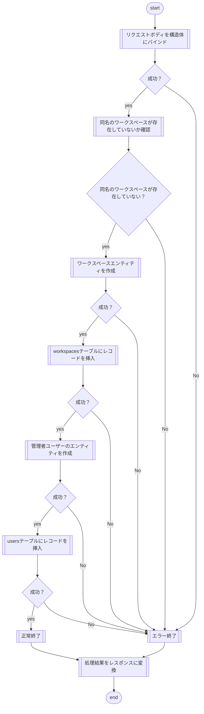
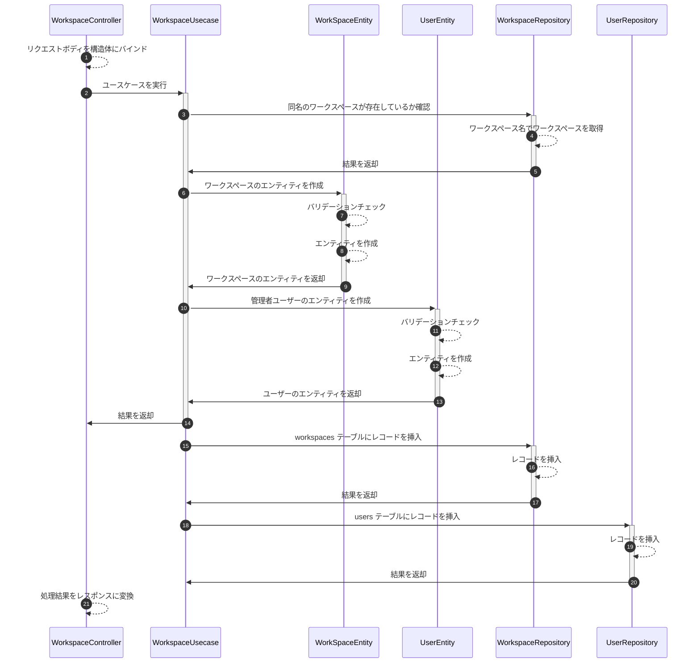

# 🚀 00-00\_ワークスペースの作成 🚀

---

## 🔹 概要

ワークスペースを作成する。

## 🔹 対応ユースケース

ワークスペースの作成

## 🔹 パラメータ

### リクエスト

- ワークスペース名
- 管理者ユーザー名
- 管理者 E-mail アドレス
- 管理者パスワード

### レスポンス

- メッセージ

## 🔹 関連テーブル

- workspaces
- users

## 🔹 処理フロー

## 🔹 処理内容

### リクエストボディを構造体にバインド

- リクエストボディを構造体にバインドする。
- エラーが発生した場合は、以下のエラー返す。

  |     コード      | メッセージ |
  | :-------------: | :--------- |
  | BadRequestError | エラー内容 |

### 同名のワークスペースが存在していないか確認

- workspaces テーブルからワークスペースを取得する。
- 同名のワークスペースが既に存在する場合、以下のエラーを返す。
  | コード | メッセージ |
  | :-------------: | :--------- |
  | BadRequestError | 同名のワークスペースが既に存在しています。 |

### ワークスペースのエンティティを作成

- パラメータのバリデーションチェックを行う。
- バリデーションエラーが発生した場合、以下のエラーを返す。
  | コード | メッセージ |
  | :----------------------: | :--------- |
  | ValidationError | エラー内容 |

  - ワークスペース名

    | 種類           | エラー時メッセージ                                                 |
    | :------------- | :----------------------------------------------------------------- |
    | 最小文字数(1)  | ワークスペース名は空の値を入力することはできません。               |
    | 最大文字数(50) | ワークスペース名は 50 文字より大きい値を入力することはできません。 |

- パラメータを使用して、エンティティを作成する。

### workspaces テーブルにレコードを挿入

- 作成したワークスペースのエンティティを使用して、workspaces テーブルにレコードを挿入する。
- エラーが発生した場合、以下のエラーを返す。

  |   コード    | メッセージ |
  | :---------: | :--------- |
  | SystemError | エラー内容 |

### 管理者ユーザーのエンティティを作成

- パラメータのバリデーションチェックを行う。
- バリデーションエラーが発生した場合、以下のエラーを返す。

  |     コード      | メッセージ |
  | :-------------: | :--------- |
  | ValidationError | エラー内容 |

- ユーザー名

  | 種類           | エラー時メッセージ                                           |
  | :------------- | :----------------------------------------------------------- |
  | 最小文字数(1)  | ユーザー名は空の値を入力することはできません。               |
  | 最大文字数(50) | ユーザー名は 50 文字より大きい値を入力することはできません。 |

- E-mail アドレス

  | 種類            | エラー時メッセージ                                                 |
  | :-------------- | :----------------------------------------------------------------- |
  | 最小文字数(1)   | E-mail アドレスは空の値を入力することはできません。                |
  | 最大文字数(256) | E-mail アドレスは 256 文字より大きい値を入力することはできません。 |
  | メールアドレス  | E-mail アドレスが不正です。                                        |

- パスワード

  | 種類            | エラー時メッセージ                                             |
  | :-------------- | :------------------------------------------------------------- |
  | 最小文字数(6)   | パスワードは 6 文字より小さい値を入力することはできません。    |
  | 最大文字数(128) | パスワードは 50 文字より大きい値を入力することはできません。   |
  | 半角英数字記号  | パスワードは半角の英数字と記号以外を入力することはできません。 |

- パラメータを使用して、エンティティを作成する。

### users テーブルにレコードを挿入

- 作成した管理者ユーザーのエンティティを使用して、users テーブルにレコードを挿入する。
- エラーが発生した場合、以下のエラーを返す。

  |   コード    | メッセージ |
  | :---------: | :--------- |
  | SystemError | エラー内容 |

### 処理結果をレスポンスに変換

- 正常終了の場合、以下のレスポンスに変換

  | ステータス | メッセージ                     |
  | :--------: | :----------------------------- |
  |   200 OK   | ワークスペースを作成しました。 |

- エラーが発生した場合、以下のエラーを返す。

  - BadRequestError

    |   ステータス    | メッセージ |
    | :-------------: | :--------- |
    | 400 Bad Request | エラー内容 |

  - ValidationError

    |        ステータス        | メッセージ |
    | :----------------------: | :--------- |
    | 422 Unprocessable Entity | エラー内容 |

  - SystemError

    |        ステータス         | メッセージ |
    | :-----------------------: | :--------- |
    | 500 Internal Server Error | エラー内容 |

## 🔹 シーケンス図

